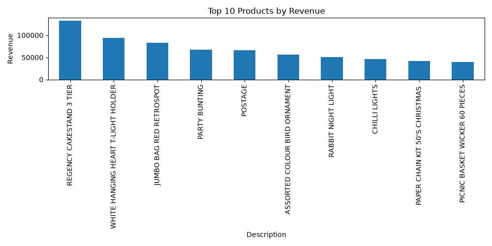
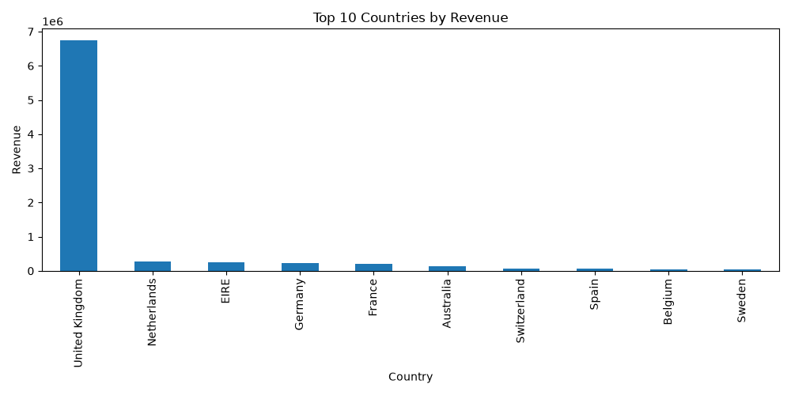
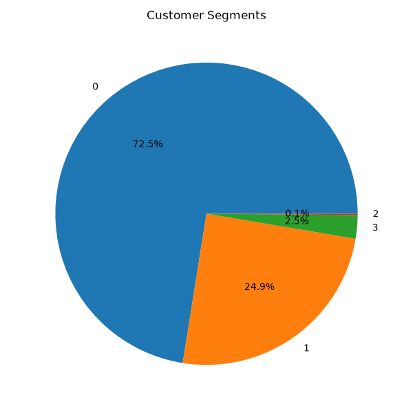

# E-Commerce Analytics & Recommendation System

## Overview

Built an end-to-end analytics and recommendation system using Python, MySQL, Pandas, and Scikit-Learn on 541,909 retail transactions.

## Features

* Data Import (CSV → MySQL)
* Data Cleaning & Preprocessing
* Revenue Analytics
* Customer Segmentation (K-Means Clustering)
* Product Recommendation System (Cosine Similarity)
* Data Visualization

## Dataset Statistics

* Transactions: 541,909
* Customers: 4,372
* Clean Records: 401,604
* Total Revenue: 9,747,747.93

## Technologies Used

* Python
* Pandas
* MySQL
* Scikit-Learn
* Matplotlib
* Git & GitHub

## Results

### Customer Segments

* Regular Customers: 3169
* At-Risk Customers: 1087
* VIP Customers: 110
* Elite Customers: 6

### Recommendation Example

Customers who purchased "WHITE HANGING HEART T-LIGHT HOLDER" were also likely to purchase related home décor products.
## Visualizations

### Top Products by Revenue

### Top Countries by Revenue

### Customer Segmentation

## Author

vansh
B.Tech CEDS
